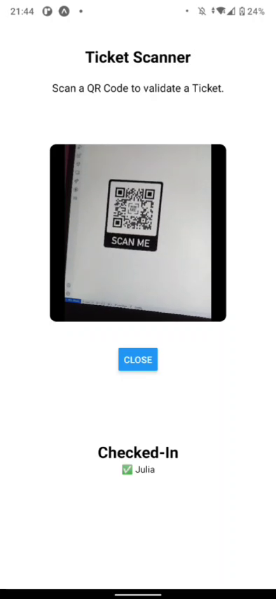
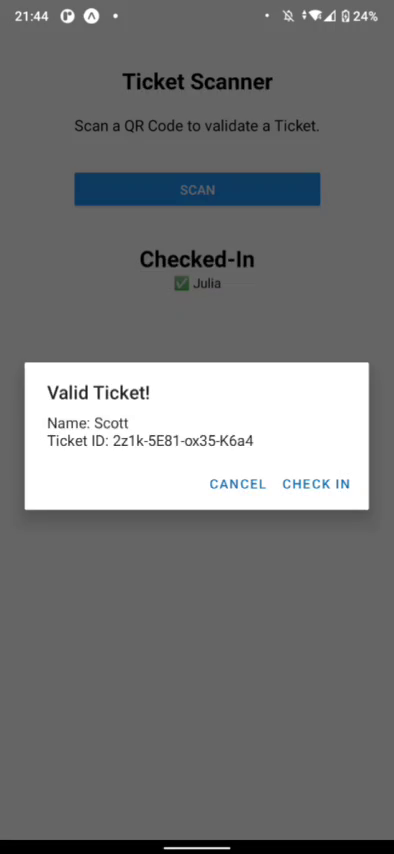
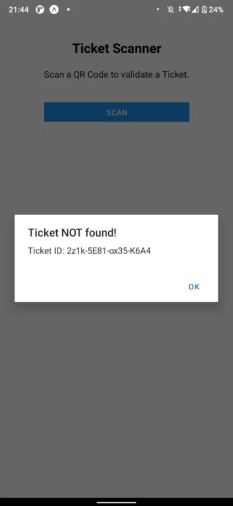
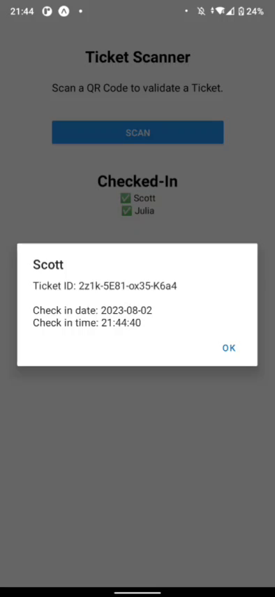

## QR-Code "Ticket Scanner" in React Native

### Download: [DEMO](https://github.com/gunnar-miklis/qr-code-scanner-app/raw/main/assets/demo/demo.mp4) Video
_(998 KB, 00:00:41)_

<table>
	<tr>
		<th>Permissions</th>
		<th>Scanner</th>
		<th>Valid</th>
		<th>Not Valid</th>
		<th>Details</th>
	</tr>
	<tr>
		<td style="border:1px solid black" width="20%">
			
		</td>
		<td style="border:1px solid black" width="20%">
			
		</td>
		<td style="border:1px solid black" width="20%">
			
		</td>
		<td style="border:1px solid black" width="20%">
			
		</td>
		<td style="border:1px solid black" width="20%">
			
		</td>
	</tr>
</table>

&nbsp;

## SETUP
#### install
```bash
$ yarn create expo-app QrCodeScanner
$ mv -v QrCodeScanner qr-code-scanner
$ cd qr-code-scanner

$ yarn expo install expo-barcode-scanner
```
```bash
$ yarn add -D eslint eslint-plugin-react eslint-plugin-react-hooks
$ yarn run eslint --init
```
#### run
```bash
$ yarn expo start 
# yarn expo start --tunnel
```
